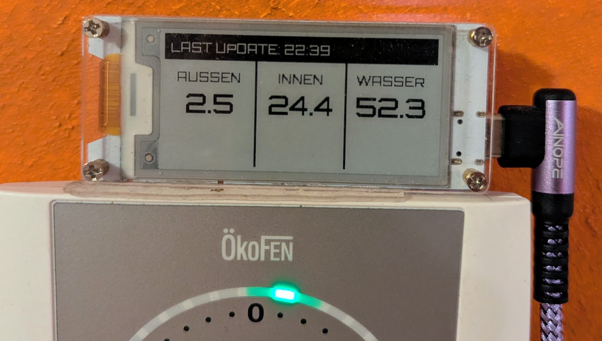

# ESP32 E-Paper Temperature Display

> An ESP32-powered E-Ink-Display that fetches the current indoor/outdoor temperature and the water temperature from an Oekofen central heating. Originally programmed in C++, I later switched to CircuitPython because it supports the display out of the box and can be customized better (e.g. adding a custom font). The original project was also published [as an article in the newspaper _Der Standard_](https://www.derstandard.at/story/3000000231560/um-20-statt-200-euro-der-heizung-die-raumtemperatur-entlocken) (article in German).

## Features

- Display the current indoor/outdoor temperature and water temperature which is fetched from a JSON API of the central heating every five minutes.
- Synchronize time via NTP and automatically adjust for Central European Summer Time (the timezone used is GMT+1).
- Display errors of the heating system (e.g. no pellets remaining)

### Technical Details

- **Hardware:** Heltec Wireless Paper (ESP32-S3 + E-Ink Display)
- **Connectivity:** WiFi (2.4GHz), NTP for time synchronization
- **Protocols:** JSON via HTTP GET, REST-like API
- **Fonts:** Custom bitmap fonts (Orbitron) for better readability

## Setup

1. Install CircuitPython on the ESP32 board (I used the ["Heltech Wireless Paper"](https://heltec.org/project/wireless-paper/) board, but other boards with integrated displays should also work, check out [the CircuitPython Website](https://circuitpython.org/downloads) for supported boards)
2. Clone the git repository: `git clone https://github.com/jakspt/tempdisplay.git`
3. [Install the necessary dependencies on the ESP32 board](https://circuitpython.org/libraries) (my board used version 10.x):
   - `adafruit_bitmap_font`
   - `adafruit_bus_device`
   - `adafruit_display_text`
   - `font_orbitron_medium_webfont_12` (included in the [CircuitPython Fonts Bundle](https://github.com/adafruit/circuitpython-fonts))
   - `font_orbitron_medium_webfont_24`
   - `adafruit_connection_manager`
   - `adafruit_ntp`
   - `adafruit_requests`
4. Ensure that there is a `setting.toml` file on the board that contains `CIRCUITPY_WIFI_SSID` and `CIRCUITPY_WIFI_PASSWORD` (also optionally `CIRCUITPY_WEB_API_PASSWORD` for using CircuitPython's Web API)
5. Create a json_details.py file in the root folder that contains the heating's host IP, host port and json "password" (see [json_details_example.py](json_details_example.py))
6. Upload the `code.py` file to the board and ensure the board and central heating are connected to the same network.

## Reverse-Engineering the Oekofen API

Since the heating system's JSON interface was largely undocumented, I had to reverse-engineer the data endpoints. By analyzing the raw JSON output and correlating it with the physical thermostat values, I identified the correct keys for sensor data. [This source](https://github.com/thannaske/oekofen-json-documentation) helped me a lot in the process. See also [my article](https://www.derstandard.at/story/3000000231560/um-20-statt-200-euro-der-heizung-die-raumtemperatur-entlocken) for more details (available only in German).
